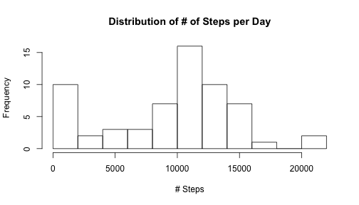
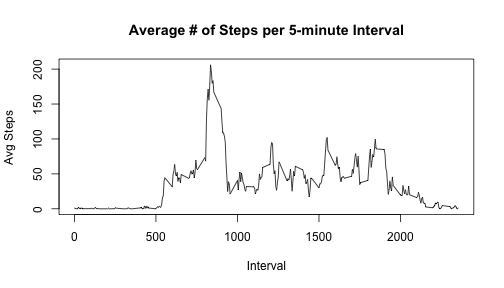
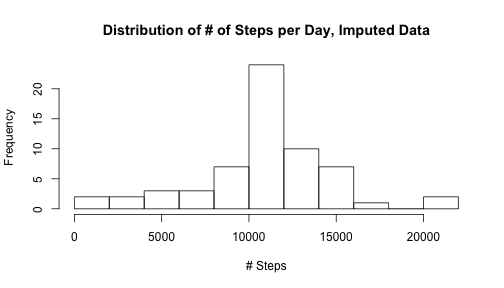
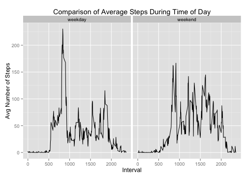

## Reproducible Research Peer Assessment 1
Mark Morscher

### Background

For this Peer Assessment assignment, I will be loading a dataset containing two months of information generated by someone's activity moinitoring device.  The data contains the # of steps taken during five minute intervals over these two months.  A variety of analysis, charts and answers to questions will be processed and presented.

========================================================
### Code and Results

Load the data (available in this repository).  The 'date' is a Factor variable, so convert it to a usable "date".  The structure of the resulting data set is presented.


```r
data = read.csv("activity.csv")
data$date = as.Date(data$date, "%Y-%m-%d")
str(data)
```

```
## 'data.frame':	17568 obs. of  3 variables:
##  $ steps   : int  NA NA NA NA NA NA NA NA NA NA ...
##  $ date    : Date, format: "2012-10-01" "2012-10-01" ...
##  $ interval: int  0 5 10 15 20 25 30 35 40 45 ...
```


Here are a few characteristics about the data, notably a Histogram, mean and median of steps per day.


```r
# Calculate Total Steps per day and plot the histogram.
dailyTotalSteps = aggregate(data$steps, list(Date = data$date), FUN = sum, na.rm = TRUE)
hist(dailyTotalSteps$x, breaks = 10, main = "Distribution of # of Steps per Day", 
    xlab = "# Steps")
```

 

```r

# Calculate and print out the Mean and Median Steps per day
cat("Mean # of Steps per Day (ignoring NAs): ", mean(dailyTotalSteps$x))
```

```
## Mean # of Steps per Day (ignoring NAs):  9354
```

```r
cat("Median # of Steps per Day (ignoring NAs): ", median(dailyTotalSteps$x))
```

```
## Median # of Steps per Day (ignoring NAs):  10395
```


Let's look at the distribution across each 5-minute interval, by daily average and which interval has the maximum average # of steps.


```r
# Calculate Average Steps per interval and plot the line chart.
intervalAverageSteps = aggregate(data$steps, list(Interval = data$interval), 
    FUN = mean, na.rm = TRUE)
plot(intervalAverageSteps$Interval, intervalAverageSteps$x, type = "l", main = "Average # of Steps per 5-minute Interval", 
    xlab = "Interval", ylab = "Avg Steps")
```

 

```r

cat("The Interval with the Maximum Average # of Steps (ignoring NAs) is ", intervalAverageSteps$Interval[which.max(intervalAverageSteps$x)])
```

```
## The Interval with the Maximum Average # of Steps (ignoring NAs) is  835
```


The next step is to do something about the NAs that exist in the 'steps' data.  I will choose to use the Mean value of steps for all the other non-NA data for that interval as the imputed value to insert in the new data. I would like to use Median, but that appears to be '0' too often.


```r
# How many NA's do we have?
cat("There are ", sum(is.na(data$steps)), " NA values for 'steps' out of ", 
    nrow(data), "observations.")
```

```
## There are  2304  NA values for 'steps' out of  17568 observations.
```

```r

# Create an imputed data set.

dataImputed = data

# If an observation has NA for its 'steps' variable, then use the
# appropriate median for that interval.

for (i in 1:nrow(dataImputed)) {
    if (is.na(dataImputed$steps[i])) {
        dataImputed$steps[i] = intervalAverageSteps$x[which(intervalAverageSteps$Interval == 
            dataImputed$interval[i])]
    }
}

# Calculate new values for the mean, median and Histogram of total steps per
# day. If I have time, I should turn this into a function.

dailyTotalStepsImputed = aggregate(dataImputed$steps, list(Date = dataImputed$date), 
    FUN = sum, na.rm = TRUE)
hist(dailyTotalStepsImputed$x, breaks = 10, main = "Distribution of # of Steps per Day, Imputed Data", 
    xlab = "# Steps")
```

 

```r

cat("Mean # of Steps per Day for Imputed data is ", mean(dailyTotalStepsImputed$x), 
    "(compared to ", mean(dailyTotalSteps$x), "when ignoring NAs)")
```

```
## Mean # of Steps per Day for Imputed data is  10766 (compared to  9354 when ignoring NAs)
```

```r

cat("Median # of Steps per Day for Imputed data is ", median(dailyTotalStepsImputed$x), 
    "(compared to ", median(dailyTotalSteps$x), "when ignoring NAs)")
```

```
## Median # of Steps per Day for Imputed data is  10766 (compared to  10395 when ignoring NAs)
```


It clearly looks like replacing the missing data has presented a noticably more active set of data (total steps higher, as you would expect).  Another interesting observation is that the median and mean of the daily total steps is now the same, which bears out in the nearly normal histogram distribution.

Lets look at the data by weekday and weekend.  We'll first add an indicator which type of day it is, and then plot the data for each to compare.  I used a side-by-side comparison using qplot since I feel it does a better job highlighting the maginitude differences between weekends and weekdays.


```r
# Add the weekday/weekend designation to the imputed data frame.

dataImputed$dateType = as.factor("weekday")
levels(dataImputed$dateType) = c("weekday", "weekend")
for (i in 1:nrow(dataImputed)) {
    if (weekdays(dataImputed$date[i]) == "Saturday" || weekdays(dataImputed$date[i]) == 
        "Sunday") {
        dataImputed$dateType[i] = as.factor("weekend")
    }
}

# Create the interval averages broken down by weekday/weekend

intervalAvgSteps = aggregate(dataImputed$steps, list(Interval = dataImputed$interval, 
    dateType = dataImputed$dateType), FUN = mean, na.rm = TRUE)

# Now plot the comparison
library(ggplot2)
qplot(Interval, x, data = intervalAvgSteps, facets = . ~ dateType, geom = "line", 
    main = "Comparison of Average Steps During Time of Day", xlab = "Interval", 
    ylab = "Avg Number of Steps")
```

 

